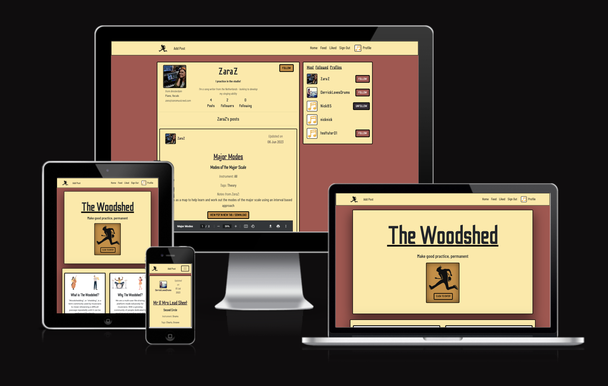

# The Woodshed


<br/>

[View the live site here](https://thewoodshed.herokuapp.com/)
<br/>
<br/>

# Table of Contents

1. [Introduction](#introduction)

2. [Project Development](#project-development)
    - 2.1 [Repos & Projects](#repos--project-links)
    - 2.2 [Aims](#aims)
    - 2.3 [Wireframes](#wireframes)
    - 2.4 [Database](#database)
      - 2.4.1 [Database Schema](#database-schema)
      - 2.4.2 [Models](#models)
          - [User Model](#user-model)
          - [Profile Model](#profile-model)
          - [Post Model](#post-model)
          - [Comment Model](#comment-model)
          - [Like Model](#like-model)
          - [Follower Model](#follower-model)
      
    - 2.5 [CRUD](#crud)
    - 2.6 [Agile Methodology](#agile-methodology)
        - [Milestones](#milestones)
        - [User Stories](#user-stories)
        - [Sprints](#sprints)
        - [MoSCoW]()
    - 2.7. [UX Design](#ux-desgin)
        - [Typography](#typography)
        - [Colour](#colour)
        - [General Styling](#bootstrap)

3. [Technologies](#technologies)
    - 3.1 [React](#react)
        - [Toastify](#toastify)
        - [Infinite Scroll](#infinite-scroll)
        - [Axios](#axios)
        - [Router](#router)
    - 3.2 [Bootstrap](#bootstrap)
    - 3.3 [Tools](#tools)

4. [Main Features](#main-features)
    - 4.1 [Logo](#logo)
    - 4.2 [Landing Page](#landing-page)
    - 4.3 [About](#about)
    - 4.4 [Navigation Bar](#navigation-bar)
    - 4.5 [Dropdown Menus](#dropdown-menus)
    - 4.6 [Footer](#footer)
    - 4.7 [Sign In / Up](#sign-in--up)
    - 4.8 [Search Bar](#search-bar)
    - 4.9 [List Views](#list-views)
    - 4.10 [Add Post](#add-post)
    - 4.11 [Posts](#posts)
    - 4.12 [Edit Post](#edit-post)
    - 4.13 [Profile](#profile)
    - 4.14 [Edit Profile](#edit-profile)
    - 4.15 [Most Followed Profiles](#most-followed-profiles)
    - 4.16 [Change Username](#change-username)
    - 4.17 [Change Password](#change-password)
    - 4.18 [Alert](#alert)

5. [Future Development](#future-developments)

6. [Testing](#testing)
    - 6.1 [Manual Testing](#manual-testing)
    - 6.2 [Automated Testing](#automated-testing)
    - 6.3 [Bugs](#bugs)

7. [Code Validation](#code-validation)
    - 7.1 [React Validation](#react-validation)
    - 7.2 [HTML Validation](#html-validation)
    - 7.3 [CSS Validation](#css-validation)
    - 7.4 [Lighthouse Report](#lighthouse-report)

8. [Deployment](#deployment)
    - 8.1 [Cloudinary](#cloudinary)
    - 8.2 [PostgresSQL](#postgresql)
    - 8.3 [Heroku](#heroku)
        - [Back-End](#back-end)
        - [Front-End](#front-end)
    - 8.4 [Forking](#forking)
    - 8.5 [Cloning](#cloning)

9. [References & Acknowledgements](#references--acknowledgements)
    - 9.1 [General Reference](#general-reference)
    - 9.2 [Code Reference](#code-reference)
    - 9.3 [Acknoledgements](#acknoledgements)
    <br />
    <br />

# Introduction

[**The Woodshed**](https://thewoodshed.herokuapp.com/)
is a React front-end multi-user file sharing application designed to allow musicians to share, like, and comment on PDF files relating to musical practice. The name of the site refers to the colloquial term _'woodshedding'_ which is often used by musicians to mean spending time in the practice room. This originates in old jazz vernacular meaning the musician should go to the woodshed, a solitary place where no-one can hear you continually get it wrong for your sake and theirs(!), until they can play the passage correctly and are ready to return. In modern times the term is now used commonly to deonte spending time practicing.

In the digital age PDFs are common as resources amongst musicians and music teachers alike. And with the large demand for online music lessons increasing during the 2020 pandemic the demand to share resources online increase.

The Woodshed attempts to demonstrate a social-media-esq application for musicians and teachers to share musical and educational resources and grow a following of students and other musicians and potentially recruit new students through the contact information. The content shared could include anything from simple exercises, to whole pieces and scores.

This site allows users to create an account, profile, and share PDF files as well as interact in the environment through likes, comments, and following users.

The Woodshed has been created as the 5th portfolio project for the [Code Institue](https://codeinstitute.net) Full Stack Software Development Diploma and has no intended commerical purpose.

Built using: [React](https://react.dev/), [Django Rest Framework](https://www.django-rest-framework.org/), [React Bootstrap](https://react-bootstrap.netlify.app/), [CSS](https://www.w3.org/Style/CSS/Overview.en.html#:~:text=Cascading%20Style%20Sheets%20(CSS)%20is,CSS%20and%20on%20available%20software.), and [HTML(JSX)](https://www.w3schools.com/react/react_jsx.asp), as well as [Cloudinary](https://cloudinary.com/) for image and file storage, [ElephantSQL](https://www.elephantsql.com/) for database management, and [Heroku](https://www.heroku.com/) for deployment hosting.

<br />
<br />

# Project Development

## Repos & Project Links
- [Front-end Repository](https://github.com/NickWaldock/the-woodshed)
- [Front-end Project Board](https://github.com/users/NickWaldock/projects/7)<br><br>
- [Back-end Repository](https://github.com/NickWaldock/the-woodshed-api)
- [Back-end Project Board](https://github.com/users/NickWaldock/projects/6)<br><br>
- [Github Profile](https://github.com/NickWaldock)
<br><br><hr>

## Aims
- Design and create a multi-user interactive front-end web application using HTML, CSS, and JavaScript based on component composition<br><br>
- Create a interactive front-end application that consumes custom API data and has CRUD functionality<br><br>
- Create a back-end API to allow users to store and manipulate data records<br><br>
- Demonstrate the key role that specialist front-end developers perform in modern software development teams<br><br>
- Maintain a consistient and simple user interface design aesthetic
- Create an application designed for musicians and music teachers to act as a platorm for sharing musically educational and/or music-related file content
- Create an application designed for musicians and music teachers to interact with one another through likes, comments, and follow; where they can share ideas and gain new students via their presence on the site
<br />
<br />
<hr />

## Database
[Django REST Framework](https://www.django-rest-framework.org/) was utilised for building a custom API in a seperate repository which can be viewed here: <br> --> <strong><ins>[The Woodshed API](https://github.com/NickWaldock/the-woodshed-api)</strong>

[ElephantSQL](https://www.elephantsql.com/) was used to host and manage the PostgreSQL database. The database works in tandem with the REACT front-end application to manage and store data delivered via the custom API. 
<br/><br>

### Database Schema
The following database design was decided upon during development to facilitate reaching the project's purpose and [aims](#aims)<br>
<image src="readme-files/backend/database.png" width=70%><br>

<em>*Database schema created using [LucidChart](https://www.lucidchart.come)</em><br><br>

### Models
In order to fulfil the requirements of the project database [models](https://docs.djangoproject.com/en/4.2/topics/db/models/) would be required to store data. The following are the models created and used by the API to allow the users to interact with and manipulate data on the site.<br><br>

#### <ins>***User Model***
[Django Auth](https://docs.djangoproject.com/en/4.2/topics/auth/) is a built in Django library that automatically manages all user creation, authorisation and authentication. This was utilised to handle the heavy lifting of user management. Features include password checking, permissions, and user management through the admin panel.<br><br>


#### <ins>***Profile Model***
<image src="readme-files/backend/models/profile-model.png" width=70%><br>

- The Profile model relates to the <a href="#user">User</a> django auth package via the <strong><em>`owner`</em></strong> model attribute in a one-to-one relationship. Meaning a user can only have a single profile linked to its instance within the application<br><br>
- <strong><em>'created_at'</em></strong>
([Date Time Field](https://docs.djangoproject.com/en/4.2/ref/forms/fields/#datetimefield)) timestamps that will be automatically added to the creation of the user. This data is not currently being viewed in the front-end but is available to view in the back-end admin panel (this feature has been noted as a <a href="#future-developments">future development</a>). The `auto_now_add=True` setting gets the current date and time, setting the intital date time value for the instance<br><br>
- <strong><em>'updated_at'</em></strong>
([Date Time Field](https://docs.djangoproject.com/en/4.2/ref/forms/fields/#datetimefield)) timestamps that will be automatically added to the updating of the profile. This data is not currently being viewed in the front-end but is available to view in the back-end admin panel (this feature has been noted as a <a href="#future-developments">future development</a>). The `auto_now=True` setting gets the current time.<br><br>
- <strong><em>'name'</em></strong>
([Character Field](https://docs.djangoproject.com/en/4.2/ref/forms/fields/#charfield)) is the attribute for the user to add optionally in the front-end. One of the remits for the site is that users will eventually be able to use it to find new contacts/students. This field has been added to allow the user to add their real name to the site if they so choose. This will be an optional field with the form permissions handled in the front-end<br><br>
- <strong><em>'description'</em></strong>
([Text Field](https://docs.djangoproject.com/en/4.2/ref/models/fields/#textfield)) Biographical info can be added here to give context for other users as to who this profile is for, why they are there, and what their experience is and what they are likey to be posting about<br><br>
- <strong><em>'headline'</em></strong> is a short (maximum of 80 characters, 
[Character Field](https://docs.djangoproject.com/en/4.2/ref/forms/fields/#charfield)) text string which aims to be an attention-grabber for when a user views a profile. Inspiration for this comes from the popular social media site [Twitter](https://twitter.com)<br><br>
- <strong><em>'instrument'</em></strong>
([Character Field](https://docs.djangoproject.com/en/4.2/ref/forms/fields/#charfield)) means the user can add thier instrumental specialisms to their profile, giving context to the content they are likely to share. [Future developments](#future-developments) will offer dedicated pages for searching instrument specific content or users<br><br>
- <strong><em>'location'</em></strong>
([Character Field](https://docs.djangoproject.com/en/4.2/ref/forms/fields/#charfield)) Allows users to input their location. This is only intended as a general location and not a specific location, e.g. 'New York', or 'Manchester'. This is biograpical data that may in [future developments](#future-developments) utilise a google maps feature, or feature where users can search for profiles based on general geo-location<br><br>
- <strong><em>'email'</em></strong>
([Email Field](https://docs.djangoproject.com/en/4.2/ref/forms/fields/#emailfield)) Caputures a valid email with Django's automatic [email validator](https://docs.djangoproject.com/en/4.2/ref/validators/#django.core.validators.EmailValidator) and displays an error if the user input doesn't conform to this. Like the name attribute this will be an optional field with this permission handled in the front-end<br><br>
- <strong><em>'image'</em></strong>
([Image Field](https://docs.djangoproject.com/en/4.2/ref/forms/fields/#imagefield)) This allows the user to upload a profile image which becomes the user's '[Avatar](#)' in the front-end. Images are stored on the cloud file storage service [Cloudinary](https://cloudinary.com). When a user first creates an account they are designated a temporary profile image until they upload their own. Django's image form field uses [Pillow](https://pillow.readthedocs.io/en/latest/handbook/image-file-formats.html), a [file extension validator](https://docs.djangoproject.com/en/4.2/ref/validators/#django.core.validators.FileExtensionValidator) to determine valid image files
<br><br>


#### <ins>***Post Model***
<image src="readme-files/backend/models/post-model.png" width=70%><br>

- <strong><em>'owner'</em></strong>
([Foreign Key](https://docs.djangoproject.com/en/4.2/ref/models/fields/#foreignkey)) is a Many to One relationship with the `User` model. A single use can own and have multiple post instances related to it. Also links to the `owner` attribute in the [profile model](#profile-model). The `on_delete=models.CASCADE` setting means all posts related to this profile will be deleted if the user is deleted. <em>*Note: If the `profile` instance is seperate from the user model, if the profile instance is deleted and not the <em>user</em> instance then the post data will continue to exist</em><br>

- <strong><em>'created_at'</em></strong> 
([Date Time Field](https://docs.djangoproject.com/en/4.2/ref/forms/fields/#datetimefield)) logs the time the post instance was created and uploaded to the database. This data will be used in the front-end to display a date of creation on the post component. This attribute will be the date shown unless the post is later updated, in which case the updated date will display. The `auto_now_add=True` setting gets the current date and time, setting the intital date time value for the instance<br>

- <strong><em>'updated_at'</em></strong>
 ([Date Time Field](https://docs.djangoproject.com/en/4.2/ref/forms/fields/#datetimefield)) logs the time the post instance was updated by the user and uploaded to the database. This value will display and be the dominant data timestamp for the post instance instead of the above `created_at` field. This is so in the front-end posts can be filtered by the most recently updated<br>

- <strong><em>'title'</em></strong> 
([Character Field](https://docs.djangoproject.com/en/4.2/ref/forms/fields/#charfield)) is the main title of a post. This field is searchable by the user in the [Search Bar]() component<br>

- <strong><em>'subtitle'</em></strong> 
([Character Field](https://docs.djangoproject.com/en/4.2/ref/forms/fields/#charfield)) this is the subtitle of a post, for the user to expand on the main post title with engaging but brief informational context to encourage a user to view the rest of the content, similar to purpose of the [Headline](#profile-model). This is a searchable field in the [Search Bar]() component<br>

- <strong><em>'description'</em></strong> 
as a ([Text Field](https://docs.djangoproject.com/en/4.2/ref/models/fields/#textfield)) alllows the user to add more detailed information and allows for more data input than a `CharField`. This is where the bulk of information relating to the post will reside. Users can add specific and detailed instructions to posts and further context in th epurpose of the post and using the PDF file. Including: notes, how-to-use, suggestions, etc<br>

- <strong><em>'instrument'</em></strong> 
([Character Field](https://docs.djangoproject.com/en/4.2/ref/forms/fields/#charfield)) allows the user to add a list of instruments that the post is designed to be used for in practice. This is a searchable field in the [Search Bar]() component<br>

- <strong><em>'tags'</em></strong> 
([Character Field](https://docs.djangoproject.com/en/4.2/ref/forms/fields/#charfield)) allows the user to add a list of key word tags to the post. This is a searchable field in the [Search Bar]() component<br>

- <strong><em>'file'</em></strong> 
([File Field](https://docs.djangoproject.com/en/4.2/ref/models/fields/#filefield)) is the primary purpose of the site, to upload and share PDFs documents. Here the user can upload only a PDF file, as the vast majority of musical performance, practice, and education digital content is shared as PDF files, it prudent for the early stages of this project to keep file formats singularly to PDFs to help with site formating and previewing. Files are stored in the [Cloudinary](https://cloudinary.com) cloud file storage service via the `upload_to` attribute.

  `validators=[FileExtensionValidator(allowed_extensions=['pdf'])]`
  This snippet of code in the model handles the post upload authentication for file types by only accepting files with a suffix of .pdf. This will need to be further addressed as a [future development](#future-developments) as this kind of file validation will not discourage users from attempting to circumvent the validation by uploading files where the file suffix has been manually changed to ".pdf" when the file is <em>not</em> actually in a PDF format. This behaviour would likely cause rendering errors. Additional file types would need to be included as valid filetypes in teh project, or more robust file validation
<br>
- <strong><em>Ordering</em></strong>: Posts display with the most recent date stamp first with the following code:
```python
class Meta:
   ordering = ['-created_at']
```
<br>

#### <ins>***Comment Model***
<image src="readme-files/backend/models/comment-model.png" width=70%><br>

- <strong><em>'owner'</em></strong> 
([Foreign Key](https://docs.djangoproject.com/en/4.2/ref/models/fields/#foreignkey)) links a single comment to a single `User` via a `Foreign Key`. A user can own multiple comments on any post instance. `User, on_delete=CASCADE` means if a `User` instance is deleted, all comments owned by that user will also be deleted<br>

- <strong><em>'post'</em></strong> 
([Foreign Key](https://docs.djangoproject.com/en/4.2/ref/models/fields/#foreignkey)) links a comment instance to a `Post` instance creating a relationship for the comment to exist only with a certain post, this is done similarily via the `Foregin Key` relationship. `Post, on_delete=CASCADE` means that if a post is deleted, all comments directly related to that post will be deleted<br>

- <strong><em>'created_at'</em></strong> 
([Date Time Field](https://docs.djangoproject.com/en/4.2/ref/forms/fields/#datetimefield)) time stamps the creation of the comment with the current time. Similarly to the same action in the [Post Model](#post-model). This time stamp will displayed as 'time elapsed since posting' in the comment component so users can see how long ago comment was created<br>

- <strong><em>'updated_at'</em></strong> 
([Date Time Field](https://docs.djangoproject.com/en/4.2/ref/forms/fields/#datetimefield)) time stamps the current time the comment was updated. Similarly to the same attribute in the [Post Model](#post-model).  This time stamp will displayed as 'time elapsed since posting' in the comment component so users can see how long ago comment was created and will override the `created_at` time stamp<br>

- <strong><em>'content'</em></strong> 
([Text Field](https://docs.djangoproject.com/en/4.2/ref/models/fields/#textfield)) is where the main text content of the comment is stored<br>

- <strong><em>Ordering</em></strong>: Posts display with the most recent date stamp first with the following code:
```python
class Meta:
   ordering = ['-created_at']
```
<br><br>


#### <ins>***Like Model***
<image src="readme-files/backend/models/like-model.png" width=70%><br>

- <strong><em>'owner'</em></strong> 
([Foreign Key](https://docs.djangoproject.com/en/4.2/ref/models/fields/#foreignkey)) links a like instance to a single `User` via a `Foreign Key`. A user can 'like' multiple `Post` instances. `User, on_delete=CASCADE` means if a `User` instance is deleted, all 'likes' owned by that user on any post in the database will also be deleted. With this, it can be possible to view all posts that a user has 'liked'.<br>

- <strong><em>'post'</em></strong> 
([Foreign Key](https://docs.djangoproject.com/en/4.2/ref/models/fields/#foreignkey)) links a 'like' instance to a `Post` instance creating a relationship for the 'like' to exist only with a certain post, this is done similarily via the `Foregin Key` relationship. `Post, on_delete=CASCADE` means that if a post is deleted, all 'likes' directly related to that post will be deleted for any relevant `Users`<br>

- <strong><em>'created_at'</em></strong> 
([Date Time Field](https://docs.djangoproject.com/en/4.2/ref/forms/fields/#datetimefield)) creates a current time stamp for when a `User` has 'liked' a post. <em>*Note: This field does not require an `updated_at` model attribute. This is because a 'like' instance will either exist or not. If a user is to 'unlike' a post, the 'like' instance is removed completely and not updated. A repeated 'like' action will create a new 'like' instance</em><br><br>


#### <ins>***Follower Model***
<image src="readme-files/backend/models/follower-model.png" width=70%><br>

- <strong><em>'owner'</em></strong> 
([Foreign Key](https://docs.djangoproject.com/en/4.2/ref/models/fields/#foreignkey)) links a follower instance to a single `User` via a `Foreign Key`. A `related_name='following` means that this relationship can be accessed in the front-end for data display to show which profiles this singular profile has chosen to link to or 'follow'. A user can 'follow' multiple profiles (or `owners`). `User, on_delete=CASCADE` means if a `User` instance is deleted, all 'follow' relationships creted by that user will also be deleted. This function allows us to filter posts from only profiles the current user is 'following'<br>

- <strong><em>'followed'</em></strong> 
([Foreign Key](https://docs.djangoproject.com/en/4.2/ref/models/fields/#foreignkey)) works similarly to the above attribute in that a relationship is created between a `User` who is being 'followed' by other profiles. The `related_name='followed'` means we can view how many other profiles have chosen to 'follow' <em>this</em> profile.

- <strong><em>'created_at'</em></strong> 
([Date Time Field](https://docs.djangoproject.com/en/4.2/ref/forms/fields/#datetimefield)) provides a current time stamp when the relationship was established. <br><em>*Note: This field does not require an `updated_at` model attribute. This is because a 'like' instance will either exist or not. If a user is to 'unlike' a post, the 'like' instance is removed completely and not updated. A repeated 'like' action will create a new 'like' instance</em>
<br><br><hr>

## CRUD Functionality

This project incorporates CRUD (Create, Read, Update, Delete) functionality as a key feature. Users will need to be able to create, edit and update existing elements, and finally delete any created content. All content stored in the back-end is to be kept updated in the front-end rendering so changes remain apparent to the user.

<br/><hr>

## Wireframes
Wireframes were produced during the intitial development of the project to guide design and layout. Even though the product went through a design change in the early stages, this was only related to color scheme and typograpy, so the original wireframes were still valid.<br /><br>

<ins>***Landing Page***</ins><br/>
The Landing Page is a simple Jumbotron design front and center including the site name, headline, and logo which acts as a quick sign-in button for users familiar with the site. The Navbar contains the traditional sign in and sign up links, and the brand logo on the left hand side, this exists on every page including on mobile views.
<table>
  <tr>
    <td>
      <image src="readme-files/wireframes/landing-page.png" width=70%>
      <image src="readme-files/wireframes/landing-page-mobile.png" width=22%>
    </td>
  </tr>
  <tr>
    <td>
      Further down the Landing Page is a set of four cards each with two images and text. The images are to portray various instruments indicating the eclectic nature of the site to cater for all musical practices. The cards will provide short descriptive info on the sites purpose and ethos. Below the cards will be a single "Get Started" button which will lead directly to the sign in page.
    </td>
  </tr>
  <tr>
    <td>
      <image src="readme-files/wireframes/landing-page-2.png" width=70%>
  </tr>
</table>
<hr />

<ins>***Sign In / Up***</ins><br/>
The Sign Up page is styled exactly the same as the Sign In page with the exception of the addition of the confirm password field. Both contain the sign up/in simple form mirrored by the main logo on the right. On mobile view, the main logo will not display to prioritise the form.
<table>
  <tr>
    <td>
      <image src="readme-files/wireframes/sign-in-up.png" width=70%>
      <image src="readme-files/wireframes/sign-in-up-mobile.png" width=22%>
    </td>
  </tr>
</table>
<hr />

<ins>***Home / Feed / Liked***</ins><br/>
The 3 main list pages are indentical in layout and design, the only difference between them is the filtered content. Home page will display all posts, Feed will display only posts from users your profile is following, and Liked will only display posts you have 'liked'. 

At this point the user is logged in and we have all Navbar links displaying. These links collapse into a typical 'burger' menu in mobile view. Additionaly, a profile avatar and link to the user's profile page renders on the right hand side where it exists on all pages when logged in. The add post link is kept seperate from the other links to be distinctive and easy to find. This link does not move to the burger menu in mobile but is the sole link in the center of the navbar. This is because it is assumed this link will be the most commonly used in the navigation element and saves the user having to click through to the burger menu to create a post.

A seach bar sits just below the navbar for easy searching of posts. 

<table>
  <tr>
    <td>
      <image src="readme-files/wireframes/feed.png" width=70%>
      <image src="readme-files/wireframes/feed-mobile.png" width=22%>
    </td>
  </tr>
</table>

The Popular Profiles segment is a component that will exists on all list-based pages. It shows popular profiles on the site with user's avatars, username, and the option to follow/unfollow depending on followed status. In mobile view this moves to the top of the page above the search bar and will show a maximum of 4 avatars.

Finally the posts themselves are rendered on a background the help them standout from the main site background. Each post element includes all of the post details: Title, subtitle, username and avatar of the author, date last updated, the instrument the post is designed for, and relevant user added tags and notes. Just before the PDF preview is rendered a button is available which will open the PDF in a new tab and in full screen with the option to download. 
<br /><br /><hr />

<ins>***Add Post***</ins><br/>
This page contains a form which allows the user to upload a new post. The PDF upload area is kept seperate from the form for ease of use. The form contains the input fields for the post model including: Title, Subtitle, Description (which displays as 'Notes' in the later rendering), Instrument, Tags, and finally two buttons, one to submit the form and the other to cancel and retun the user to thier previous page.

Here we can can mention the footer which exists and the bottom on all pages but may not be immediately visiable due to content. It contains social links and copyright information.
<table>
  <tr>
    <td>
      <image src="readme-files/wireframes/add-post.png" width=70%>
    </td>
  </tr>
</table>
<hr />

<ins>***Profile***</ins><br/>
Clicking on any user avatar on a posts or popular profile component, or clicking on your own profile link in the nav bar will bring you to the profile page. Here a user can see all submitted information about a specific user. If the logged in user is the owner of the profile they have the option to edit the profile throught the gear icon (which will also render in the below posts). The profile header contains: user avatar, location, instrument played, and contact info on the left; main username, real name (small and in brackets), headline, and biography. Underneath are basic analytics for the number of posts the user has written, number of followers, and number of people that user is following. 

Finally, underneath the profile header all posts relating to that user are rendered. On mobile view the Popular Profiles component renders above the profile header as it does on the list pages.
<table>
  <tr>
    <td>
      <image src="readme-files/wireframes/profile.png" width=70%>
    </td>
  </tr>
</table>
<hr />

<ins>***Edit Profile***</ins><br/>
When a user clicks on the gear icon in their profile a drop down menu appears to allow them to edit thier profile. This brings them to this page which is designed similarly to the Add Post page. The form contains all of the relevant fields, note these fields will be empty as the user is not required to fill in this information to create an account. The image will also set to a default for the same reason.Here the user can upload an image for the user avatar. The Cancel button returns the user to the previous page and the Save button submits the form.
<table>
  <tr>
    <td>
      <image src="readme-files/wireframes/edit-profile.png" width=70%>
      <image src="readme-files/wireframes/edit-profile-mobile.png" width=24%>
    </td>
  </tr>
</table>
<hr />

<ins>***Update Password / Update Username***</ins><br/>
Wireframes were not included for this feature as the forms are a single field. For more info see [Change Password](#change-password) in [Main Features](#main-features)
<br />
<br />
<hr />


## Agile Methodology

A [Agile](https://agilemanifesto.org/) development approach was undertaken in the conception of the project. Specifically in this project, relating to the use of user stories, milestones, and sprints to dictate the development process and responding to change in design as the project progressed with the ultimate aims in mind.

The following sections in this readme will detail the development process undertaken. 

[Github Projects](https://docs.github.com/en/issues/planning-and-tracking-with-projects/learning-about-projects/about-projects) was used to manage the project tasks. Each task was listed within a [Milestone](#milestones) and a [User Story](#user-stories), and was finally assigned proiritisation under the [MoSCoW](#moscow) system. Tasks were loaded into the Backlog and tackled during [sprints](#sprints). Sprints were not strictly defined to within certain timeframes as they would be in a professional team development environment, this was due to the nature of my current working practices which are unpredictable making it difficult to plan when development work on the project would occur. The sprints therefore were flexible in terms of time frame and are instead better arranged by sections/features of development.


The project management board for the front-end can be viewed here: --> [GitHub Projects](https://github.com/users/NickWaldock/projects/7)

Additinoally, the project board for the back-end can be viewed here: --> [Back-End Project](https://github.com/users/NickWaldock/projects/6)

<br/><hr>

### Milestones

#### Front-end project development:

With initial conceptual design complete though [wireframes](#wireframes) development was organised into key [Milestones](https://github.com/NickWaldock/the-woodshed/milestones)

- Authentication & Registration
    - Sign in, account registration, page authentication

- CRUD Posts & Profiles
    - Functionality within components to create, edit profiles, comments and posts, and delete comments and posts

- Navigation
    - Navigating the site through the navigation bar or buttons

- Interactions
    - Any actions a user takes in interacting with other users of the site: i.e. Likes, followers, followed by, comments

- UX Design
    - Aesthetic and cosmetic design

- Bugs
    - Issues documented in [GitHub Issues](https://github.com/NickWaldock/the-woodshed/issues)

- Documentation & Testing
    - Tests, planning, readme, and other documentation

#### Back-End Project Development Milestones
The [milestones](https://github.com/NickWaldock/the-woodshed-api/milestones) for the back-end development were managed seperately but were similar in scope to the front-end.
- Authentication & Profiles
- CRUD Functionality
- User Interactivity
- Forms
- Deployment
- Bugs
- Documentation


### User Stories

### Sprints
The following screen shots demonstrate the various sprints undertaken during the project's development. The project [kanban board](https://github.com/users/NickWaldock/projects/7/views/2) was used exclusivly to keep track of tasks.
<table>
  <tr>
   <td><image src="readme-files/sprints/1.png" width=100%></td>
    <td><image src="readme-files/sprints/2.png" width=100%></td>
  </tr>
    <tr>
   <td><image src="readme-files/sprints/3.png" width=100%></td>
    <td><image src="readme-files/sprints/4.png" width=100%></td>
  </tr>
    <tr>
   <td><image src="readme-files/sprints/5.png" width=100%></td>
    <td><image src="readme-files/sprints/6.png" width=100%></td>
  </tr>
    <tr>
   <td><image src="readme-files/sprints/7.png" width=100%></td>
    <td><image src="readme-files/sprints/8.png" width=100%></td>
  </tr>
    <tr>
   <td><image src="readme-files/sprints/9.png" width=100%></td>
    <td><image src="readme-files/sprints/10.png" width=100%></td>
  </tr>
    <tr>
   <td><image src="readme-files/sprints/11.png" width=100%></td>
    <td><image src="readme-files/sprints/12.png" width=100%></td>
  </tr>
</table>
<br/><hr>

### MoSCoW

The [MoSCoW](https://en.wikipedia.org/wiki/MoSCoW_method) method was used to determine the priority of certain tasks and to maintain sprints within the project's scope. These were added as labels to each individual task.

Tasks were assigned a status in the project [kanban board](https://github.com/users/NickWaldock/projects/7/views/2) of either:
- <strong>Must Have</strong> : Essential for the project
- <strong>Should Have</strong> : Important but not essential
- <strong>Could Have</strong> : An idea for consideration but not a priority
- <strong>Won't Have</strong> : Not currently in the project's scope
<br/><hr>

## UX Design
### Typograpgy
[Google Fonts](https://fonts.google.com/) provided the fonts for the site. Fonts used are:<br>
- [Odibee Sans](https://fonts.google.com/specimen/Odibee+Sans?preview.text=The%20Woodshed&preview.text_type=custom&category=Sans+Serif,Display&query=odibee) : As the main title font for components and buttons<br>
- [Barlow Condensed](https://fonts.google.com/specimen/Barlow+Condensed?preview.text=The%20Woodshed&preview.text_type=custom&category=Sans+Serif,Display&query=barlow+condense) : As a primary body text and occasional title or subtitle text <br>
- [Roboto](https://fonts.google.com/specimen/Roboto?preview.text=The%20Woodshed&preview.text_type=custom&category=Sans+Serif,Display&query=roboto) : as a secondary body text
<br>
<image src="readme-files/site-screenshots/utilities/fonts.png" width=70%>

With sans-serif as back-up fonts
<br/><br>

### Colors

[Colormind](http://colormind.io/) is an AI-based colour scheme generator that was used to determine the projects colour scheme.
<image src="readme-files/site-screenshots/utilities/colors.png">
The following colour pallete was used in the develpment of this project. With the exception of #87AA8D (Green). This colour hasn't yet found a place in the project, but it fits well with the others in the pallette and will be used at a future date.


### General Styling
<br/><hr>


### Change of Style
During the development process the main logo design and colour scheme was adapted. The original logo, font, and colours (below) were deemed to give the wrong impression, relating more to a literal tool workshop or tool supplier site rather than a more creativly-based project. The original logo, fonts and colors were created by [Looka](https://www.looka.com) which was also responsible for the current logo and logo fonts <br>
<image src="readme-files/site-screenshots/old-style/old-logo.png" width=50%>
<br><hr>

# Technologies
## React
[REACT](https://react.dev/) is a popular JavaScript library that creates interfaces out of individualised components that combine to create the users screen experience.


### Toastify
[Toastify](https://www.npmjs.com/package/react-toastify) is s React library for creating custom pop-up alerts. In this project I wanted to utilise a custom alert that wasn't the typical bootstrap alert style. This alert has a progress bar that indicated to the user when it will dissapear, it also has an animation effect when entering the screen and leaving the screen. The alert is shown when a user changes data in the database such as a post or profile update or submits a form.
<br>
<image src="readme-files/site-screenshots/utilities/alert.png" width=50%>

### Infinite Scroll
The [Infinite Scroll](https://www.npmjs.com/package/react-infinite-scroll-component) component for React is a feature that adds data when a user scrolls down the page, saving data loading times by avoiding the requirement to load all list post data at once.

### Axios
The [Axios](https://www.npmjs.com/package/react-axios) library tells the react app to make requests to the [API](https://github.com/NickWaldock/the-woodshed-api)

It also utilies [Interceptors](https://lightrains.com/blogs/axios-intercepetors-react/) automatically intercept API requests and respones allowing custom code to be exectued before the action is complete. In this project interceptors were used for two main applications:
- <strong>Response:</strong> Listen for a 401
 ([access token](https://jwt.io) expired) response from the API, refresh the access token, repeat the request again. Keeps the user logged-in for upto 24hrs

- <strong>Request:</strong> Intercepts any request the React application makes to the 
[API](https://github.com/NickWaldock/the-woodshed-api) that requires the user to be logged-in to retrieve (such as retireving a single post instance), refreshes the user's [access token](https://jwt.io) before the request is made

<br><br>

[PostPage.js](https://github.com/NickWaldock/the-woodshed/blob/main/src/pages/posts/PostPage.js):<br>
<image src="readme-files/code-screenshots/axios.png">
<br>Here axios intercepts the data request to the API (checking the user's access token is valid or refreshing it) before setting the data for the post and comments.
<br><br>

### Router
The [React Router](https://reactrouter.com/en/main/start/overview) enables "Client-side routing": <br><br>
<em>"In traditional websites, the browser requests a document from a web server, downloads and evaluates CSS and JavaScript assets, and renders the HTML sent from the server. When the user clicks a link, it starts the process all over again for a new page.

Client side routing allows your app to update the URL from a link click without making another request for another document from the server. Instead, your app can immediately render some new UI and make data requests with fetch to update the page with new information.

This enables faster user experiences because the browser doesn't need to request an entirely new document or re-evaluate CSS and JavaScript assets for the next page. It also enables more dynamic user experiences with things like animation."</em> - from [React Router](https://reactrouter.com/en/main/start/overview)<br><br>
<image src="readme-files/code-screenshots/route.png"><br>
Here the routes for component to allow the user to sign in, sign up, create a post, view a specific post, and edit a specific post are displayed. ([App.js](https://github.com/NickWaldock/the-woodshed/blob/main/src/App.js))

## Bootstrap
This project utilises [React Bootstrap](https://react-bootstrap.netlify.app) for general page and component layout and organisation. Similar to traditional [Bootstrap](https://getbootstrap.com), this library is built specificially for use with React.

## Tools
The following tools were used in development:

- PNGs
  - https://pngtree.com/
  - https://webcode.tools/generators/css/keyframe-animation
- Font Awesome
- Box shadow generator
  https://www.cssmatic.com/box-shadow
  http://colormind.io/bootstrap/#

<br/><hr>

# Main Features
The following is a list of all of the current main features with descriptions of functionality.
<hr/>

## <ins>***Logo***
<table>
  <tr>
    <td>
      <image src="readme-files/site-screenshots/logo/main-logo.png" width=100%>
    </td>
    <td>
      The logo for The Woodshed application was created using the online logo generator
      <a href="https://looka.com/">Looka</a>. The logo wanted to be simple and fun, in -line with the site's design principles and denote a musical instrument of some kind.
    </td>
  </tr>
</table>
<br/>
<hr/>

## <ins>***Landing Page***
<table>
  <tr>
    <td>
      The first page the user arrives at is simple and bold, making a clear statement where the user is and what to do. The logo and button "Click to Enter" are a single link card that directs the user straight to the login page. The original idea behind the card was to look like a vip backstage tour pass from a music festival, this more detailed styling of design will be completed at a later date. on mobile view this is much smaller meaning the user can see the beginning of the site info below.
    </td>
    <td>
      <image src="readme-files/site-screenshots/mobile/landing-page-1.png" width=100%>
    </td>
    
  </tr>
  <tr>
    <td>
      <image src="readme-files/site-screenshots/landing-page/landing-page.png" width=100%>
    </td>
    <td><image src="readme-files/site-screenshots/mobile/landing-page-2.png" width=100%></td>
  </tr>
</table>
<br/>
<hr/>

## About
<table>
  <tr>
    <td>
      <image src="readme-files/site-screenshots/landing-page/landing-page-info.png" width=49%>
      <image src="readme-files/site-screenshots/landing-page/landing-page-info-2.png" width=49%>
    </td>
  </tr>
  <tr>
    <td>
      Below the main jumbotron of the landing page are four cards. Each card contains succint and general information about the site with casual images denoting a variety of instruments and musicians. The titles of the cards and the related text offer the user context to the purpose of the application and the ethos whilst attempting to maintain a fun and casual approach.
      <br/>
      <br/>
      Below the four cards is a wide call to action button to encourage the user to "Get Started". This button directs the user to the login page where they can either login or navigate to create an account.
    </td>
  </tr>
</table>
<br/>
<hr/>

## <ins>***Navigation Bar***
<table>
  <tr>
    <td>
      <image src="readme-files/site-screenshots/navigation/navbar.png" width=100%><br/><hr /><image src="readme-files/site-screenshots/mobile/navbar.png" width=50%>
    </td>
  </tr> 
  <tr>
    <td>
      The navigation bar is a standard <a href="https://getbootstrap.com/docs/4.0/components/navbar/"><em>Bootstrap Navbar</em></a> component that expands to the full width of the user's screen and automatically becomes a typical expandable menu or 'burger' menu on the top right for mobiles at a breakpoint of 767px screen-width.
      <br/><br/>
      When a user is not logged in the navbar only displays the Sign In and Sign Up navigation links. When a user is logged in all available links display. 
      <br/><br/>
      'Add Post' displays on the left-hand side and seperately from the rest of the links so it is easily identifyable to the user, this leads to the Add Post page. In mobile view this link does not appear in the burger menu but continues in the main navbar and centered making it still distinct from the other navigation elements.
      <br/><br/>
      <em>'Home'</em>, <em>'Feed'</em>, and <em>'Liked'</em> navigation links direct the user to the realted list pages. This is essentially a single list page which renders the available posts in reverse chronological order through one of teh following filter options: Home renders all posts, Feed renders only the posts of profiles the user is following, and Liked only renders posts the the user has 'liked'.
      <br/><br/>
      Sign Out leads the user back to the Landing Page and de-authenticates them giving them a logged-out status.
      <br/><br/>
      The current user's avatar image is the users profile picture which can be uploaded in the Edit Profile page. This image and profile nav link leads the user to their profile page.
      <br/><br/>
      The site logo is always present on the left-hand side, is clickable and leads to the landing page.
    </td>
  </tr>
</table>
<br/>
<hr/>

## <ins>***Dropdown Menus***
<table>
  <tr>
    <td>
    Additional edit options are available for a logged-in user with relevant access privilidges for the post component and the profile component which are represented by a gear icon. These are dropdown menus providing the uer with links to additional pages: The profile gear leads the user to the Edit Profile page where what can add additional profile information, change their username, or change their password; The post gear offers an edit and delete function, edit directs the user to the edit post page, and delete will permanently delete that post instance from the database.
    </td>
  </tr>
  <tr>
    <td>
      <image src="readme-files/site-screenshots/navigation/post-dropdown.png" width=50%>  <image src="readme-files/site-screenshots/navigation/profile-dropdown.png" width=44%>
    </td>
  </tr>
</table>
<br/>
<hr/>

## <ins>***Footer***
<table>
  <tr>
    <td>
    A basic footer exists on all pages regardless of user authentication status. On most pages it will not be seen unless the user scrolls down past the page content, this is especially true for the post list pages where the footer will only be visible once all posts in the database have been rendered.
    <br/><br/>
    Four icons link to social pages: Linkedin links to my Linkedin profile, Github links to my github repos, and, Facebook and YouTube link to the main homepages for those social sites and act as demo links.
    <br/><br/>
    The links embedded within the text link to <a href="https://codeinstitute.net/"><ins><em>Code Institute</em></a> it is for this course that this project has been created; and finally below, a link to my <a href="https://nicholasjameswaldock.uk/"><ins><em>personal website</em></a>. 
    </td>
  </tr>
  <tr>
    <td>
      <image src="readme-files/site-screenshots/navigation/footer.png" width=100%>
    </td>
  </tr>
</table>
<br/>
<hr/>

## <ins>***Sign In / Up***
<table>
  <tr>
    <td>
      <image src="readme-files/site-screenshots/sign-in-up/sign-in.png" width=49%>
      <image src="readme-files/site-screenshots/sign-in-up/sign-up.png" width=49%>
    </td>
  </tr>
  <tr>
    <td>
      After the user has clicked on either the 'Get Started!' button on the Landing Page or one of the first available Navbar links they are brought to this Sign In page. Here a user can securely log into the account. The back-end for this functionality is handled automatically by <a href="https://docs.djangoproject.com/en/4.2/topics/auth/"><em>Django Authentication</em></a> which include basic user management including "password strength checking, throttling of login attempts, authentication against third-parties, object-level permissions" (from Django <a href="https://docs.djangoproject.com/en/4.2/topics/auth/"><em>docs</em></a>).
    </td>
  </tr>
  <tr>
    <td>
      The if the user is a first-time visitor to the application they can easily find links to create an account in the Navbar or below the sign in form.
      <br/><br/>
      The Sign Up page is almost identical to the Sign In page with the addition of a confirm password box and swapped links to login if the user already has an account.
    </td>
    <td>
      <image src="/workspace/the-woodshed/readme-files/site-screenshots/mobile/sign-in.png" width=200%>
    </td>
  </tr>
</table>
<br/>
<hr/>

## <ins>***Search Bar***
<table>
  <tr>
    <td>
      <image src="readme-files/site-screenshots/utilities/search.png" width=100%>
    </td>
  </tr>
  <tr>
    <td>
    The search bar exists at the top of all of the list pages: Home, Feed, and Liked. It allows the user to search for posts via title and for profiles by username. Future functionality will be added to allow for searching of for profiles via profile elements including location, instrument, and bio; as well as post searching all other post elements including: instrument, tags, subtitle, and possibly even the description.
    <br/><br/>
    The search bar filters search results with a short timeout function to prevent the page updating too quickly from every keyboard stroke, and a data loading spinner appears while posts are being rendered.
    </td>
  </tr>
</table>
<br/>
<hr/>

## <ins>***List Views***
<table>
  <tr>
    <td>
      <image src="/workspace/the-woodshed/readme-files/site-screenshots/list-views/feed.png" width=70%>
      <image src="/workspace/the-woodshed/readme-files/site-screenshots/mobile/list.png" width=29%>
    </td>
  </tr>
  <tr>
    <td>
      <image src="/workspace/the-woodshed/readme-files/site-screenshots/list-views/home.png" width=100%>
    </td>
  </tr>
  <tr>
    <td>
      Three main list views represent the main experience for the user. 
      <br/><br/>
      <strong>Home</strong> is typically where the user can view all available posts that exist within the database. These are organised by the time the post was last updated or created so the most recent post or update is at the top.
      <br/><br/>
      <strong>Feed</strong> will render posts in the same manner as Home but filtered by only those posts by profiles that the current logged in user is actively following.
      <br/><br/>
      <strong>Liked</strong> will also render posts in the same manner as Home but filtered to display only those posts that the current logged in user has actively 'liked', i.e. clicked the thumbs up icon in a post component.
      <br/><br/>
      These list pages also include the Most Followed Profiles component on the right hand side in desktop which displays above the search bar instead in mobile view. This component does not 'stick' to the top of the view.
      <br/><br/>
      The list pages also include post pagination to help with user experience loading mulitple post data, especially as some file sizes could make loading posts slower if rendering all post instances at once. The first 10 posts will load on page refresh, a following 10 posts will load if the usre scrolls to the bottom of the page. This process repeats until all posts are loaded.
    </td>
  </tr>
  <tr>
    <td>
      <image src="/workspace/the-woodshed/readme-files/site-screenshots/list-views/liked-1.png" width=50%>
      <image src="/workspace/the-woodshed/readme-files/site-screenshots/list-views/liked-2.png" width=49%>
    </td>
  </tr>
</table>
<br/>
<hr/>

## <ins>***Add Post***
<table>
<tr>
  <td>
    A major piece of functionality for the application is the abilty to generate new posts. A clear, simple design means the user can clearly discover the process for creating a new post. The main body of the window is taken up by the clickable area to upload a PDF. In mobile view this stacks on top of the form.
    <br/><br/>
    The form includes placeholder text to indicate the kind to information to be added to each field. Fields include: Title, Subtitle, a text area for a detail description, instrument (the instrument the post is intended to serve), and any relevant tags.
    <br/><br/>
    A cancel button will return the user to their previous page without submitting the post and the create button submits the form and directs the user to the detail view of that created post and displays a success message.
    <br/><br/>
    The form contains error handling to ensure all fields have data inputted. A form with an empty field will not be submitted and an alert on the form will display.
  </td>
</tr>
  <tr>
    <td>
      <image src="readme-files/site-screenshots/posts/add-post.png" width=72%><image src="readme-files/site-screenshots/mobile/add-post.png" width=27%>
    </td>
  </tr>
</table>
<br/>
<hr/>

## <ins>***Posts***
<table>
<tr>
  <td>
    The post component is where the majority of the applications interaction occurs. The top of the component has the post author's avatar which links to that user's profile page, on the right is the date for when the post was last updated and further to that, if the current logged in user is the post owner, is the gear icon leading to a <a href="#dropdown-menus"><em>dropdown menu</em></a> for editing the post.
    <br/><br/>
    The main information for the post component is then displayed in order of relevance to a user. This begins with the title and subtitle,followed by the instrument(s) the post is desigined to be used with, and the related tags. Finally, what was added in the Add Post page form for the description is rendered here as "Notes from {user}" which gives any final details to the user. 
    <br/><br/>
    A button to redirect the user to a new page where the pdf can be viewed i full screen and has other general browser PDF viewing options such as, zoom, rotate, and download. This always opens in a new tab to avoid taking the user away from the main application.
    <br/><br/>
    The PDF is then rendered as a preview for the user to be able to interact with it and view it within the component. They also have access to the basic PDF viewing options here as well. 
    <br/><br/>
    Finally, in this component is the like and comment icons. The like icon (thumbs up) is clickable and the icon's colour changes of hover and once it has been clicked. On clicking the icon the colour changes and the counter on the right of it will increase by one, indicating the post has been liked. This post will then be available in the user's Liked page. 
  </td>
</tr>
  <tr>
    <td>
      <image src="readme-files/site-screenshots/posts/post-1.png" width=70%>
      <image src="/workspace/the-woodshed/readme-files/site-screenshots/mobile/post.png" width=29%>
    </td>
  </tr>
  <tr>
    <td>
      <image src="readme-files/site-screenshots/posts/post-2.png" width=70%>
    </td>
  </tr>
</table>
<br/>
<hr/>

## <ins>***Edit Post***
<table>
  <tr>
    <td>
    The Edit Post page is built from the same code as the Add Post page with the addition of a feature to prepoulate the page with all existing data related to the post to be edited. Once the form data has been edited and/or the PDF file has been changed (or not, fields can remain unchanged), clicking 'Save' will redirected the user to the updated version of the individual post detail view. A success Alert will pop up to indicate the successful update of the post. If the user clicks the cancel button the user is returned to the same post detail view but as but without any of the changes made in the Edit Post form/file.
    </td>
  </tr>
  <tr>
    <td>
      <image src="readme-files/site-screenshots/posts/edit-post.png" width=72%>
      <image src="readme-files/site-screenshots/mobile/edit-post.png" width=27%>
    </td>
  </tr>
</table>
<br/>
<hr/>

## <ins>***Profile***
<table>
<tr>
    <td>
      If a user has clicked on a user's avatar in a post, the Most Followed Profiles component or on their profile Navbar link, they are directed to a profile page to view all details about that specific user or their own profile.
      <br/><br/>
      If it is the user's own profile the gear icon appears in the top right of the component as a dropdown menu to edit the profile, change the username, or change the password.
      <br/><br/>
      The profile's picture renders in the top left of the component and is the only time the profile image is not clickable. But it displays larger than the more commonly seen user avatar. Underneath the profile image is the users details (if they exist): given name, location, instrument(s), and contact email.
      <br/><br/>
      Otherwise the profile takes on a similar aesthetic to the post component and displays the profile information centered within a single column. Username; headline, a short descriptive statement, a biography; and finally some basic profile data.
      <br/><br/>
      Basic profile data consists of real-time reflection of this user's interactions within the application.<br/>
        - Posts indicates the number of posts that profile has published<br/>
        - Followers indicates the number of other user profiles that are following this particular profile<br/>
        - Following indicates the number of other profiles that this profile is actively following<br/><br/>
        Finally, under the main profile information is a list (in order of most recent) of all of that user's posts.
    </td>
  </tr>
    <td>
      <image src="readme-files/site-screenshots/profile/profile.png" width=73%>
      <image src="readme-files/site-screenshots/mobile/profile.png" width=26%>
    </td>
  </tr>
  <tr>
    <td>
      When a user first signs up to the site they only do so with a username and a password. On a first visit to the profile page they will be presented with an empty profile. The profile image is a default image and the posts list will be empty (assuming they haven't created a post yet).
    </td>
  </tr>
  <tr><tr>
    <td><image src="readme-files/site-screenshots/profile/empty-profile.png" width="100%"></td>
  </tr>
  <tr>
</table>
<hr/>

## <ins>***Edit Profile***
<table>
  <tr>
    <td>
      The Edit Post page is constructed in a similar fashion to the Edit Post page. The user's profile information will pre-poplulate with the user's data if it exists.<br/></br>
      The form contains authenication and will only submit on completed fields to make sure the user has some , with the exception of Name and Email, these two fields can be left blank and the form will not throw any errors and can be submitted. As the site is intended for musicians and music teachers to share resources it is also available for users to share contact information in order to recruit students or colloaborators, this is why the more personal details of name and email have been left as optional. In the future as the site grows, the implications of security and privacy will need to be addressed.
    </td>
  </tr>
  <tr>
    <td>
      <image src="readme-files/site-screenshots/profile/edit-profile.png" width=100%>
    </td>
  </tr>
</table>
<br/>
<hr/>

## <ins>***Most Followed Profiles***
<table>
  <tr>
    <td>
      This component appears on  profile pages and all list pages. In mobile view it renders above the search bar or above the profile header in the profile pages. In larger screens it is rendered on the right-hand side of the page. It doesn't not scroll. This component renders the most followed profiles, profiles with a higher follower count will appear at the top of the list.
      In mobile view this component will only render the top four avatars. <br/><br/>
      The component has a reactive follow/unfollow button. If the user is not currently following a profile the button will display 'follow', on click the button changes to 'unfollow' and the backgorund color changes to signify the user is now followed. If the user was to go to to their profile or that user's profile they would see the followers and following number have increase respectively.
    </td>
  </tr> 
  <tr>
    <td>
      <image src="readme-files/site-screenshots/profile/most-followed.png" width=50%><image src="readme-files/site-screenshots/mobile/list.png" width=30%>
    </td>
  </tr>
</table>
<br/>
<hr/>

## <ins>***Change Username***
<table>
  <tr>
    <td>
      A user can choose to change thier username if they wish, through the gear icon <a href="#dropdown-menus"><em>dropdown menu</em></a> in their profile.
    </td>
    <td><image src="readme-files/site-screenshots/navigation/profile-dropdown.png" width="100%"></td>
  </tr>
  <tr>
    <td>
      Clicking this option brings the user to this simple form where they can submit a new username. Clicking save will update the profile database instance which will reflect on all relevant components, it will also reflected in authentication in the sign in page, requiring the user to use the updated username to log in. Clicking cancel returns the user to their profile page.
    </td>
  </tr>
  <tr>
    <td>
      <image src="readme-files/site-screenshots/utilities/username.png" width=100%>
    </td>
  </tr>
</table>
<br/>
<hr/>

## <ins>***Change Password***
<table>
  <tr>
    <td>
      A user can choose to change thier password if they wish, through the gear icon <a href="#dropdown-menus"><em>dropdown menu</em></a> in their profile.
    </td>
    <td><image src="readme-files/site-screenshots/navigation/profile-dropdown.png" width="100%"></td>
  </tr>
  <tr>
    <td>
      <image src="readme-files/site-screenshots/utilities/password.png" width=100%>
    </td>
  </tr>
  <tr>
    <td>
      Clicking this option brings the user to this simple form where they can submit a new password. Clicking save will update the user authorisation which will be reflected in authentication for the user in the sign in page, requiring use of the updated password to log in. Clicking cancel returns the user to their profile page.
    </td>
  </tr>
</table>
<br/>
<hr/>

## <ins>***Alert***
<table>
  <tr>
    <td>
      The <a href="https://www.npmjs.com/package/react-toastify"><em>Toastify</em></a> package is used to display a simple success message on major crud operation such as: creating a post and updating a post or profile. The post is styled with custom css to maintain design aesthetics with the rest of the site.
    </td>
  </tr>
  <tr>
    <td>
      <image src="readme-files/site-screenshots/utilities/alert.png" width=70%>
    </td>
  </tr>
</table>
<br/>
<hr/>
<br/>

# Future Developments
This project inherently holds a great deal of potential developmental possibilities both in terms of file sharing, and as a musicians practice companion. Below is a list of possible future developments that are currently out of scope but could be considered for further iterations of the project.


### General Improvements
- In the post list views the post component descriptions could preview a few lines if the content with a 'show more' button, if the content is over a certain length
- Full user profile CRUD functionality - the abiltiy for a user to delete thier profile and their user instance if they wihed to leave the site
- Larger PDF file sizes. Post handling for larger PDF file sizes, not be previewed in list views (to save data loading) but have links to view in seperate page. Better for large PDFs such as orchestral scores, section parts, which can inherently be much larger than a typical PDF
- Additional file formats. Incorporate additional file formats that musicians commonly use: firstly other image files such as PNG, and JPEG but also including music-specific formats such as: [MIDI](https://en.wikipedia.org/wiki/MIDI), [Sibelius](https://www.avid.com/sibelius?gclid=CjwKCAjw44mlBhAQEiwAqP3eVsvE7t6X28TIr8thw0TbNdghx0F1i_sEYJt8T1GwbRMIVVRAdDPtWhoCre4QAvD_BwE), [MusicXML](https://en.wikipedia.org/wiki/MusicXML), [iReal Pro HTML](https://www.irealpro.com/ireal-pro-file-format), or [JAM](https://en.wikipedia.org/wiki/JAM_notation) to mention a few. Previews and full page expressions of these filetypes in components would need to be tailored.
- Media Player. Users can upload audio (mp3/WAV/AIFF) alongside their PDF, a basic media player allows the user to play the audio whilst reading along with the PDF
- Extended Profiles: Instuments listed in a user's profile can be clicked on and lead to posts or other profiles related to that particular instrument
- User notes: Users can make their own private notes on a post or PDF when they have saved it (currently 'liked'). These notes could be made public or kept private
- More Complex Profile Component: To allow for larger expressions of biograpical data such as: social/web links, and video/audio content embedding as examples of performance style
- Users could view which other profiles a profile is following or being followed by
- Users can click on the following or followers metric in a profile to get a list of users either following or being followed by that profile
- A user can currently have a blank profile if they do not visit the edit profile page to add additional profile content. A more detailed sign up page, or profile creation page could be included so users can create a profile during the process of signing up to the site
- Contact User Button: Allow users to send a private message to other users, or request to contact the user which the recipient user would have to allow
- The Popular Profiles component could show the number of followers a profile has and the whole component could always be visible when scrolling down list pages
- User Since: Profiles contain a 'user since' data display allowing users to know how long a profile has been active on the site and how recently they have been active
- Instrument Specific Pages: allowing users to search profiles or posts that are instrument specific


### Extended Scope
- Users could apply to admins for a verified Tutor status to add to their profile. Users could add a status of Tutor, Student, or Professional to their profile
- Practice Companion: The app could contain a component dedicated as a practice companion and include tools for users to work with the PDF content immediately. Tools such as: a metric-meter adjustable and customisable metronome, pitch tuner,
- Habit Tracker Component: Users can track their progress on the site and view analytics on their interactions. This component would be particularly useful/applicable if the application has the above Practice Companion component. Users could track data such as: number of times practiced, practice duration, streaks, self-efficacy reporting, and note-taking
- Users could post video tutorials alongside their PDFs content
- Location can be developed to utilise a google maps API for generalised location display, or an ability for users to search for profiles in a generalised and localised area
- More robust file validation for PDFs or abiltiy to upload different filetypes that can be previewed and renderes and that behave similarly to the current PDFs. Protection agains users attempting to circumvent basic PDF validation by changing filetype suffix to ".pdf"

<br/><hr><br/>
# Testing
## Manual Testing

Manual testing has been carried out on the application to determine the outcome of expected functions, events, and interactions. The tables in the below files indicate the type of test applied, the expected outcome, the actual outcome, and any errors found and linked to an issue in the [project board](https://github.com/users/NickWaldock/projects/7).

A detailed list of all manual testing under-taken can be found here: <br/> 
[>> Manual Testing](/readme-files/testing/manual-testing.md)
<br/><br/><hr>

## Automated Testing

React uses [Jest](https://jestjs.io/docs/tutorial-react) as its test runner, this was used in conjunction with the [React Testing Library](https://testing-library.com/docs/react-testing-library/intro/) which comes with a range of utility methods to test components in isolation.

Additionally, [Mock Service Worker](https://mswjs.io/docs/) was used during automated testing to supply mock API calls.

<image src="readme-files/testing/navbar-test.png" width=80%><br/>

Automated tests were used to determine whether the Navbar renders links correctly. 

<image src="readme-files/testing/testing-results.png" width=30%><br/>

The full code for these tests can be found here: >>> [NavBar Testing](https://github.com/NickWaldock/the-woodshed/blob/main/src/components/__tests__/NavBar.test.js)
<br/><br/><hr>

## Bugs
Here is a summary of known bugs and issues discovered from the testing procedure: 

<table>
  <th>BUG</th>
  <th>Status</th>
  <tr>
    <td>
    <a href="https://github.com/users/NickWaldock/projects/7/views/1?filterQuery=BUG&pane=issue&itemId=31576277">
    Deleting a post redirects the user to tsignin page and then to homepage</a>
    </td>
  <td>SOLVED</td>
  </tr>
  <tr>
    <td>
    <a href="https://github.com/users/NickWaldock/projects/7/views/1?filterQuery=BUG&pane=issue&itemId=31612906">Console error "Can't perform a React state update on an unmounted component"</a>
    </td>
  <td>UNRESOLVED</td>
  </tr>
  <tr>
    <td>
    <a href="https://github.com/users/NickWaldock/projects/7/views/1?filterQuery=BUG&pane=issue&itemId=31649372">Possible to navigat to pages when unauthenticaed via the url bar</a>
    </td>
  <td>SOLVED</td>
  </tr>
  <tr>
    <td>
    <a href="https://github.com/users/NickWaldock/projects/7/views/1?filterQuery=BUG&pane=issue&itemId=31839935">404 Not FOund errors when pdfs are rendering on two particualr profiles, even though the files are rendering ok in the DOM</a>
    </td>
  <td>SOLVED</td>
  </tr>
  <tr>
    <td>
    <a href="https://github.com/users/NickWaldock/projects/7/views/1?filterQuery=BUG&pane=issue&itemId=31586557">Toastify alert won't display on the delete post function</a>
    </td>
  <td>UNRESOLVED</td>
  </tr>
  <tr>
    <td>
    <a href="https://github.com/users/NickWaldock/projects/7/views/1?filterQuery=BUG&pane=issue&itemId=31976680">In Safari on OSX and iOS, user login attempts continually redirect top the landing page</a>
    </td>
  <td>SOLVED</td>
  </tr>
  <tr>
    <td>
    <a href="https://github.com/users/NickWaldock/projects/7/views/1?filterQuery=BUG&pane=issue&itemId=31066437">Clicking on a user profile redirects back to the home page instead of profile page</a>
    </td>
  <td>SOLVED</td>
  </tr>
  <tr>
    <td>
    <a href="https://github.com/users/NickWaldock/projects/7/views/1?filterQuery=BUG&pane=issue&itemId=31034422">Popular profiles component is not rendering in the post detail page view</a>
    </td>
  <td>SOLVED</td>
  </tr>
  <tr>
    <td>
    <a href="https://github.com/users/NickWaldock/projects/7/views/1?filterQuery=BUG&pane=issue&itemId=31066662">PDF preview renders only one instance in the list view and not in all post instances in the list views</a>
    </td>
  <td>SOLVED</td>
  </tr>
  <tr>
    <td><a href="https://github.com/NickWaldock/the-woodshed-api/issues/54">(Back-end)/profiles/url recieves a 500 error on accessing</a></td>
    <td>SOLVED</td>
  </tr>
</table>
<br/><br/>
The following bugs persist and are permissible as part of the submission of this project:
<br/><br/>
<strong>400 - Bad Request</strong>: Occurs when submitting incorrect form data
<image src="readme-files/testing/400.png" width=50%>
<br/><br/>
<strong>401 - Unauthorised</strong>: Occurs when an accesses token has expired and is refreshed in the background
<image src="readme-files/testing/401-1.png" width=50%>
<br/><br/>
<strong>401 - Unauthorised</strong>: Occurs when navigating to the sign in or sign up page when not logged in, this console error occurs when checking if the logged in user needs to be redirected from this page<br>
<image src="readme-files/testing/401-2.png" width=50%>

<br/><hr><br/>
# Code Validation

## React Validation
[ES Lint](https://marketplace.visualstudio.com/items?itemName=dbaeumer.vscode-eslint) was installed into VS code for continual code validation during the project development. Every JavaScript file was checked for errors or warnings and dealth with accordingly.<br><br>

At time of deployment, only one file consists of a warning for an unused variable, when the project is compiled; PdfPreview.js.
<image src="readme-files/testing/eslint-warning.png" width=70%>
<br><br>

No other issues with the [React JavaScript](https://react.dev/) code are present.

## HTML Validation
[W3C Markup Validation Service](https://validator.w3.org/) was used to validate application HTML
<br>
<details open>
<summary><ins><strong>HTML Validation Results</strong></summary>
<image src="readme-files/testing/html/root.png" width=49%>
<image src="readme-files/testing/html/signin.png" width=49%>
<image src="readme-files/testing/html/signup.png" width=49%>
<image src="readme-files/testing/html/home.png" width=49%>
<image src="readme-files/testing/html/landing-page.png" width=49%>
<image src="readme-files/testing/html/add-post.png" width=49%>
<image src="readme-files/testing/html/post.png" width=49%>
<image src="readme-files/testing/html/post-edit.png" width=49%>
<image src="readme-files/testing/html/profile-edit.png" width=49%>
<image src="readme-files/testing/html/profile.png" width=49%>
<image src="readme-files/testing/html/password.png" width=49%>
<image src="readme-files/testing/html/username.png" width=49%>
</details>
<br/>
The following info markers suggested removing trailing slashes for JSX elements and were ignored.<br>

<image src="readme-files/testing/html/info.png" width=49%>

## CSS Validation
[W3C Markup Validation Service](https://validator.w3.org/) was used to validate application CSS via uploading the individual CSS module files. All CSS files pass the W3C Validator with no errors. Some warnings show (detailed below) but these are only due to W3C not validating vender extensions.<p>
    <a href="http://jigsaw.w3.org/css-validator/check/referer">
        
    </a>
</p><br>

Only one error was found during validation: <strong>LandingPage.module.css</strong>
<table>
<tr>
  <td><image src="/workspace/the-woodshed/readme-files/testing/css/landing-fail.png" width=100%></td>
  <td>This was due to not having a correct flex class. This was changed to <em>"flex: auto;"</em> which now passes validation --></td>
  <td><image src="/workspace/the-woodshed/readme-files/testing/css/landing-pass.png" width=100%></td>
</tr>
</table><br>
The warning in this file and the are relating to the use of vendor extensions in rendering a box shadow on the landing page. Other similar occuring warnings are detailed below.<br>
<details open>
<summary><ins><strong>Additional Vendor Extension Warnings</strong></summary>
<br>
For creating an outline in the thumb 'like' icon<br>
<image src="/workspace/the-woodshed/readme-files/testing/css/post-warning.png" width=49%><br><br>
For use of a box shadow in the upload image container in the 'Add Post' page
<image src="/workspace/the-woodshed/readme-files/testing/css/post-create-warning.png" width=49%><br><br>
CSS created by REACT
<image src="/workspace/the-woodshed/readme-files/testing/css/index-warnings.png" width=100%>
</details>
<br>
<details open>
<summary><ins><strong>CSS File Validations</strong></summary>
<br>

<image src="/workspace/the-woodshed/readme-files/testing/css/index.png" width=49%>
<image src="/workspace/the-woodshed/readme-files/testing/css/post.png" width=49%>
<image src="/workspace/the-woodshed/readme-files/testing/css/app.png" width=49%>
<image src="/workspace/the-woodshed/readme-files/testing/css/asset.png" width=49%>
<image src="/workspace/the-woodshed/readme-files/testing/css/avatar.png" width=49%>
<image src="/workspace/the-woodshed/readme-files/testing/css/button.png" width=49%>
<image src="/workspace/the-woodshed/readme-files/testing/css/comment-form.png" width=49%>
<image src="/workspace/the-woodshed/readme-files/testing/css/comment.png" width=49%>
<image src="/workspace/the-woodshed/readme-files/testing/css/dropdown.png" width=49%>
<image src="/workspace/the-woodshed/readme-files/testing/css/footer.png" width=49%>
<image src="/workspace/the-woodshed/readme-files/testing/css/navbar.png" width=49%>
<image src="/workspace/the-woodshed/readme-files/testing/css/pdf.png" width=49%>
<image src="/workspace/the-woodshed/readme-files/testing/css/popular.png" width=49%>
<image src="/workspace/the-woodshed/readme-files/testing/css/post-create.png" width=49%>
<image src="/workspace/the-woodshed/readme-files/testing/css/posts.png" width=49%>
<image src="/workspace/the-woodshed/readme-files/testing/css/profile-edit.png" width=49%>
<image src="/workspace/the-woodshed/readme-files/testing/css/profile-page.png" width=49%>
<image src="/workspace/the-woodshed/readme-files/testing/css/profile.png" width=49%>
<image src="/workspace/the-woodshed/readme-files/testing/css/signin.png" width=49%>
</details>


<br><hr>

## Lighthouse Report

<br/><hr><br/>
# Deployment

[The live site can be accessed here](https://the-woodshed.herokuapp.com/)
<br/><br/>
To create and deploy your own version of this application please follow the steps below.

## <ins>Cloudinary

1. Navigate to the [Cloudinary website](https://cloudinary.com/)
2. Log in or create and account
3. On the main console page click "Dashboard"
4. Here you will find all the information for the next steps

## <ins>PostgreSQL

1. Navigate to [ElephantSQL](https://www.elephantsql.com/) or another PostgresSQL database provider
2. Log in or create an account
3. Click "Create New Instance"
4. Add a name for your database, tags and a plan (Tiny Turtle is Free)
5. Click "Select Region"
6. Select your cloest region
7. Click Review
8. On the confirm page click "Create Instance"
9. Your database is now set up. Click on the name of your database in the dashboard to view all information for the next steps


## <ins>Heroku
### <em>Back-End</em>
To deploy the back-end to Heroku:
1. Log in to [Heroku](https://www.heroku.com/) (create an account if necessary)
2. From the dashboard, click on the "New" button and select "Create new app"
3. Choose an appropriate name for your app and select the region closest to your location
4. Access the "Settings" tab
5. Click on "Reveal Config Vars"
6. Add all necessary key-value pairs:
<image src="readme-files/backend/heroku-vars-backend.png">
<br/>
Required config vars:
- ALLOWED_HOST --> The URL of the back-end application
- CLIENT_ORIGIN --> The URL of the front-end application
- CLOUNDINARY_URL --> Available from Cloudinary (for image, file storage)
- DATASABE_URL --> Available from your SQL provider
- DISABLE_COLLECTSTATIC - "1"
- SECRET_KEY --> Django secret key, found in env.py file. Should be unique!

7. Access the "Deploy" tab
8. Select "GitHub - Connect to GitHub" from the deployment methods and click on "Connect to GitHub"
10. Search for the relevant GitHub repository and click it
11. Choose automatic deploys to allow the deployed site to be updated each time code is pushed to GiHub
12. Click "View" to view the deployed site. The back-end is now deployed!
<br><br>

### <em>Front-end</em>
1. Log in to [Heroku](https://www.heroku.com/) (create an account if necessary)
2. From the dashboard, click on the "New" button and select "Create new app"
3. Choose an appropriate name for your app and select the region closest to your location
4. Navigate to "Settings"
9. Select "GitHub - Connect to GitHub" from the deployment methods and click on "Connect to GitHub"
10. Search for the relevant GitHub repository and click it
11. Choose automatic deploys to allow the deployed site to be updated each time code is pushed to GiHub
12. Click "View" to view the deployed site. The site is now deployed!
<br><br>

## <ins>Forking
To fork this repository on [Github](https://github.com/NickWaldock/the-woodshed) proceed with the following steps:
1. Log it to GitHub (create an account if necessary)
2. Locate the [GitHub Respository](https://github.com/NickWaldock/the-woodshed)
3. On the repository page, find the 'Fork' menu in the top right, click on the small down arrow
4. Select '+ Create a new fork'
5. Remane repository as required
6. Click 'Create Fork'
7. You now have your forked version of this repository

<em>* Note * You can find the back-end repo for this project [here](https://github.com/NickWaldock/the-woodshed-api)</em>
<br />
<br />

## <ins>Cloning
To clone the repository procees with the following steps:
1. Log in to GitHub (create an account if necessary)
2. Locate the [GitHub Respository](https://github.com/NickWaldock/the-woodshed)
3. On the repository page, find and click on the 'Code' menu in the mid-top right of the page
4. Choose to either download or open in GitHub Desktop,
  - or;
    5. Choose the HTTPS option and copy the URL to your clipboard
    6. - To clone the repository using HTTPS, under "HTTPS", copy the url
       - To clone the repository using an SSH key, including a certificate issued by your organization's SSH certificate authority, click SSH, then copy the url
       - To clone a repository using GitHub CLI, click GitHub CLI, then copy url
    7. Open Terminal and change the current directory to where you want the cloned directory
    8. Type git clone, and paste the url, press Enter to create your local clone
<br/><br/>
<em>* NOTE * You can find the back-end repo for this project [here](https://github.com/NickWaldock/the-woodshed-api)</em>

<hr><br /><br />

# References & Acknowledgements
## General Reference
## Code Reference

Using validators for file type (pdf)
https://stackoverflow.com/questions/69054680/safe-way-to-validate-file-extension-in-serializer-django

- For adding PDF file types to the add post form
  https://stackoverflow.com/questions/12142536/how-to-make-input-type-file-should-accept-only-pdf-and-xls

## Acknowledgements

