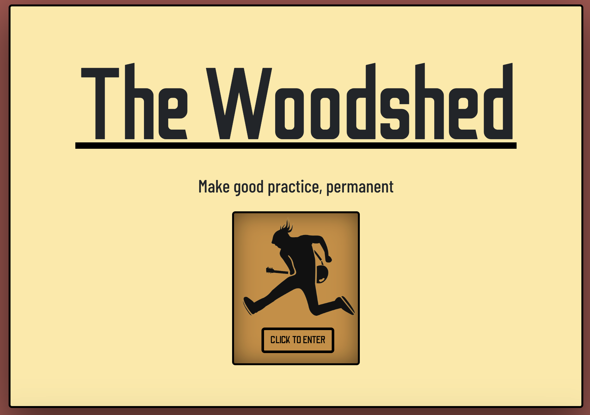

# The Woodshed

 

[View the live site here](https://thewoodshed.herokuapp.com/)
 
 

# Table of Contents
1. [Introduction](#introduction)

2. [Project Planning](#project-planning)
  - [Aims](#aims)
  - [Wireframes](#wireframes)
  - [Database](#database)
  - [Agile Methodology](#agile-methodology)
  - [Milestones](#milestones)
  - [User Stories](#user-stories)
  - [Sprints](#sprints)

3. [Technologies](#technologies)
  - [React](#react)
  - [Tools](#tools)

4. [Main Features](#main-features)
  - [UX Design](#ux-desgin)
  - [Typography](#typography)
  - [Colour](#colour)
  - [Bootstrap](#bootstrap)
  - [CRUD](#crud)
    1. [Add Post](#add-post)
    2. [View Post](#view-posts)
      - Home
      - Feed
      - Liked
    3. [Update Post](#update-posts)
    4. [Delete Post](#delete-post)
    5. [Add Category](#add-category)
    6. [Create Profile](#create-profile)
    7. [Edit Profile](#edit-profile)
    8. [Like & Comment](#like-&-comment)

3. [Future Development](#future-developments)

4. [Testing](#testing)
  1. [HTML Validation](#html-validation)
  2. [CSS Validation](#css-validation)
  3. [React Validation](#react-validation)
  4. [Lighthouse Report](#lighthouse-report)
  5. [Manual Testing](#manual-testing)
  6. [Jtest](#jtest)
  7. [Bugs](#bugs)

5. [Deployment](#deployment)
  1. [Heroku](#heroku)
  2. [Forking](#forking)
  3. [Cloning](#cloning)

6. [References & Acknowledgements](#references--acknowledgements)
  1. [General Reference](#general-reference)
  2. [Code Reference](#code-reference)
  3. [Acknoledgements](#acknoledgements)
 
 

# Introduction
[**The Woodshed**](https://thewoodshed.herokuapp.com/)
is a React front-end multi-user file sharing application designed to allow musicians to share, like, and comment on PDF files relating to musical practice. The name of the site refers to the colloquial term *'woodshedding'* which is often used by musicians to mean spending time in the practice room. This originates in old jazz vernacular meaning the musician should go to the woodshed, a solitary place where no-one can hear you continually get it wrong for your sake and theirs(!), until they can play the passage correctly and are ready to return. In modern times the term is now used commonly to deonte spending time practicing.

In the digital age PDFs are common as resources amongst musicians and music teachers alike. And with the large demand for online music lessons increasing during the 2020 pandemic the demand to share resources online increase.

The Woodshed attempts to demonstrate a social-media-esq application for musicians and teachers to share musical and educational resources and grow a following of students and other musicians. The content shared could include anything from simple exercises, to whole pieces and scores. 

This site allows users to create an account, profile, and share PDF files as well as interact in the environment through likes, comments, and following users. 

The Woodshed has been created as the 5th portfolio project for the [Code Institue](https://codeinstitute.net) Full Stack Software Development Diploma and has no intended commerical purpose.

 
 

# Project Planning
## Aims
- Design and create a multi-user interactive front-end web application using HTML, CSS, and JavaScript based on component composition
- Create a interactive front-end application that consumes custom API data
- Demonstrate the key role that specialist front-end developers perform in modern software development teams
- Maintain a consistient and simple user interface design aesthetic
 
 

## Wireframes
### Landing Page
<table>
<tr><td>
  <image src="readme-files/wireframes/landing-page.png" width=50%>
  <image src="readme-files/wireframes/landing-page-mobile.png" width=15%>
</td></tr>

<tr width=50%>
<td><image src="readme-files/wireframes/landing-page-2.png" width=50%></td>
</tr>
</table>
 
 

### Sign In / Sign Up Page

  - [Database](#database)
  - [Agile Methodology](#agile-methodology)
  - [Milestones](#milestones)
  - [User Stories](#user-stories)
  - [Sprints](#sprints)

## Refernces
Google Fonts
- Roboto
- Barlow Condensed 
    - light 300
    - Light 300 Italic
    - Regular 400
    - Medium 500
    - Semibold 600
- Odibee Sans

## SO
- For adding PDF file types to the add post form
https://stackoverflow.com/questions/12142536/how-to-make-input-type-file-should-accept-only-pdf-and-xls

## Tools
- PNGs 
  - https://pngtree.com/
  - https://webcode.tools/generators/css/keyframe-animation
- Font Awesome
- Box shadow generator
https://www.cssmatic.com/box-shadow

## Technologies
Axios
Axios interceptors
Toast
React Bootstrap

## Future Developments
All liked/saved posts can be organised into self-made categories
Post list descriptions to preview text in case the post has a larger amount of text
delete profile
tutor profile, student followers
larger pdf file sizes
additional fiile formats
in profiles, instuments in profile can be links that lead to posts or other profiles related to that instrument